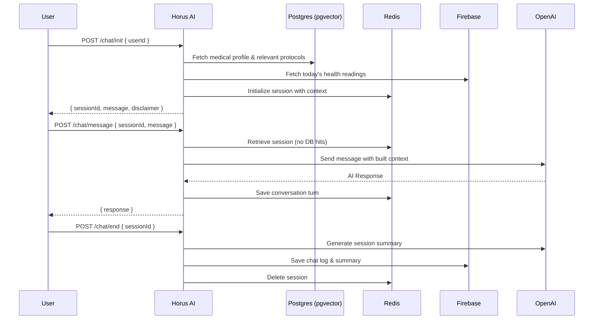

# Horus AI Service

A customized Artificial Intelligence service tailored for medical emergencies. This service is decoupled from the main Horus project and communicates via HTTP endpoints.

## 🚀 Tech Stack

- **Runtime**: Node.js + TypeScript
- **Framework**: Express
- **LLM**: OpenAI (`gpt-4o-mini` for chat, `text-embedding-3-small` for embeddings)
- **Vector Database**: PostgreSQL + `pgvector` (e.g., Neon.tech)
- **Session Cache**: Redis (e.g., Upstash)
- **Persistence DB**: PostgreSQL (User Medical Profiles) & Firebase Firestore (Health Readings & Chat Logs)
- **Text-to-Speech (TTS)**: ElevenLabs

## 🧠 Architecture Flow



## 📡 Endpoints

| Method | Route          | Description                                      |
|--------|----------------|--------------------------------------------------|
| `POST` | `/chat/init`   | Initializes session, loads medical context       |
| `POST` | `/chat/message`| Sends a message to the AI agent                  |
| `POST` | `/chat/end`    | Ends session, generates log, clears Redis        |
| `POST` | `/sync/user`   | Synchronizes medical profile changes to Redis    |
| `GET`  | `/health`      | Returns status of all dependencies               |

**Note**: All endpoints (except `/health`) require authentication via header:
```http
Authorization: Bearer <API_SECRET_KEY>
```

## 🔐 Security & Performance

- **Trust Proxy**: Configured for accurate rate-limiting behind load balancers.
- **Strict TLS/SSL**: Ensures encrypted connections to Postgres and Redis (`rejectUnauthorized: true`).
- **Dynamic CORS**: Configurable allowed origins via `.env`.
- **Token Limits**: Truncates extremely long user inputs to prevent OpenAI context exhaustion.
- **Lazy Loading**: Heavy dependencies (`pdf-parse`, `canvas`) are optimized for performance.
- **Idempotency**: Vector seed scripts use `WHERE NOT EXISTS` to prevent duplicate insertions.

## 🐳 Deployment (Docker & PaaS)

This project is fully dockerized and ready for PaaS platforms like Railway or Render, as well as traditional VPS deployments.

### 1. Environment Variables
Copy `.env.example` to `.env` and configure your credentials.
For Firebase, you can authenticate in two ways:
- **Local / VPS**: Set `FIREBASE_SERVICE_ACCOUNT_PATH=./firebase-service-account.json`.
- **PaaS (Railway, Render)**: Inject the JSON directly via `FIREBASE_SERVICE_ACCOUNT_JSON`.

### 2. Run with Docker Compose
```bash
docker-compose up -d --build
```
This will automatically spin up the Node.js backend, a Redis instance, and a PostgreSQL instance (with pgvector installed).

### 3. Run Locally (Development)
```bash
npm install
npm run dev
```

## 🛠 Project Structure

```
src/
├── config/       # Environment variables & Logger (Pino)
├── controllers/  # Route handlers
├── middleware/   # API Key Auth, Rate Limiter, Error handling
├── models/       # TypeScript interfaces
├── routes/       # Express routers
├── scripts/      # Vector DB seeding scripts
└── services/     # OpenAI, Vector DB, Redis, Firebase, and OpenFDA logic
```
