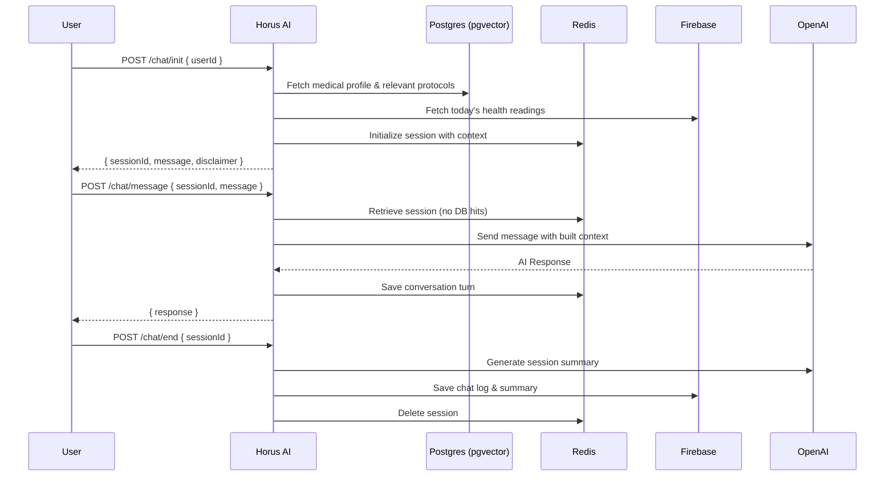

# Horus AI Service

A customized Artificial Intelligence service tailored for medical emergencies. This service is decoupled from the main Horus project and communicates via HTTP endpoints.

## 🚀 Tech Stack

- **Runtime**: Node.js + TypeScript
- **Framework**: Express
- **LLM**: OpenAI (`gpt-4o-mini` for chat, `text-embedding-3-small` for embeddings)
- **Vector Database**: PostgreSQL + `pgvector` (e.g., Neon.tech)
- **Session Cache**: Redis (e.g., Upstash)
- **Persistence DB**: PostgreSQL (User Medical Profiles) & Firebase Firestore (Health Readings & Chat Logs)
- **Text-to-Speech (TTS)**: ElevenLabs

## 🧠 Architecture Flow



## 📡 Endpoints

| Method | Route          | Description                                      |
|--------|----------------|--------------------------------------------------|
| `POST` | `/chat/init`   | Initializes session, loads medical context       |
| `POST` | `/chat/message`| Sends a message to the AI agent                  |
| `POST` | `/chat/end`    | Ends session, generates log, clears Redis        |
| `POST` | `/sync/user`   | Synchronizes medical profile changes to Redis    |
| `GET`  | `/health`      | Returns status of all dependencies               |

**Note**: All endpoints (except `/health`) require authentication via header:
```http
Authorization: Bearer <API_SECRET_KEY>
```

# Editar .env con tus valores reales
```

### 2. Infraestructura local (Qdrant + Redis)

```bash
docker-compose up qdrant redis -d
```

### 3. Migración en DB de Horus

```bash
psql -d horus_db -f migrations/001_create_chat_logs.sql
```

### 4. Instalar dependencias y correr

```bash
npm install
npm run dev
```

## Integración con Horus (lo que debe hacer el equipo)

### Al iniciar chat (frontend → backend Horus → este servicio)

```typescript
// En el backend de Horus, cuando el usuario hace clic en "Iniciar chat"
const response = await fetch("http://horus-ai:3001/chat/init", {
  method: "POST",
  headers: {
    "Content-Type": "application/json",
    "Authorization": `Bearer ${process.env.HORUS_AI_SECRET_KEY}`,
  },
  body: JSON.stringify({ userId: currentUser.id }),
});
const { sessionId, message, disclaimer } = await response.json();
// Devolver sessionId al frontend para usarlo en mensajes posteriores
```

### Al enviar mensajes

```typescript
const response = await fetch("http://horus-ai:3001/chat/message", {
  method: "POST",
  headers: {
    "Content-Type": "application/json",
    "Authorization": `Bearer ${process.env.HORUS_AI_SECRET_KEY}`,
  },
  body: JSON.stringify({ sessionId, message: userMessage }),
});
const { response: aiResponse } = await response.json();
```

### Cuando hay cambios en datos médicos del usuario

```typescript
// Llamar desde el Prisma middleware de Horus cuando cambien datos del usuario
await fetch("http://horus-ai:3001/sync/user", {
  method: "POST",
  headers: {
    "Content-Type": "application/json",
    "Authorization": `Bearer ${process.env.HORUS_AI_SECRET_KEY}`,
  },
  body: JSON.stringify({ userId }),
});
```

### Prisma middleware sugerido para Horus

```typescript
// En el proyecto Horus — prisma.ts
prisma.$use(async (params, next) => {
  const result = await next(params);

  const medicalModels = [
    "PersonalInformation", "MedicalProfile", "Allergy",
    "ChronicCondition", "UserMedication", "EmergencyContact"
  ];

  const mutationActions = ["create", "update", "delete", "upsert"];

  if (
    medicalModels.includes(params.model ?? "") &&
    mutationActions.includes(params.action)
  ) {
    const userId = params.args?.data?.userId ?? params.args?.where?.userId;
    if (userId) {
      // Fire and forget — no bloquear la operación principal
      fetch(`${process.env.HORUS_AI_URL}/sync/user`, {
        method: "POST",
        headers: {
          "Content-Type": "application/json",
          "Authorization": `Bearer ${process.env.HORUS_AI_SECRET_KEY}`,
        },
        body: JSON.stringify({ userId }),
      }).catch(console.error);
    }
  }

  return result;
});
```

## Estructura del proyecto

```
src/
├── config/
│   └── env.ts                  # Variables de entorno con validación Zod
├── middleware/
│   ├── auth.middleware.ts       # Validación API key
│   ├── error.middleware.ts      # Manejo centralizado de errores
│   └── validation.middleware.ts # Validación de body con Zod
├── models/
│   └── types.ts                 # Interfaces TypeScript
├── prompts/
│   └── system.prompt.ts         # System prompt base + primeros auxilios
├── routes/
│   ├── chat.routes.ts           # /chat/*
│   ├── sync.routes.ts           # /sync/*
│   └── health.routes.ts         # /health
├── services/
│   ├── chat.service.ts          # Orquestación del flujo completo
│   ├── gemini.service.ts        # LLM + embeddings
│   ├── qdrant.service.ts        # Vector store
│   ├── redis.service.ts         # Caché de sesiones
│   └── database.service.ts      # PostgreSQL (Horus DB)
└── index.ts                     # Entry point, Express setup
```
